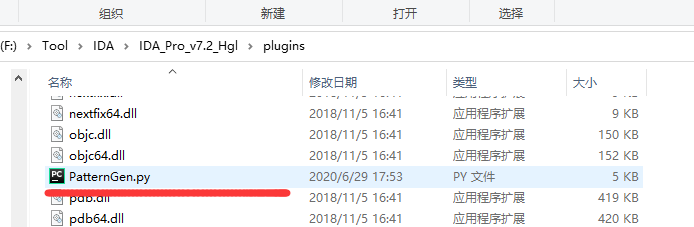
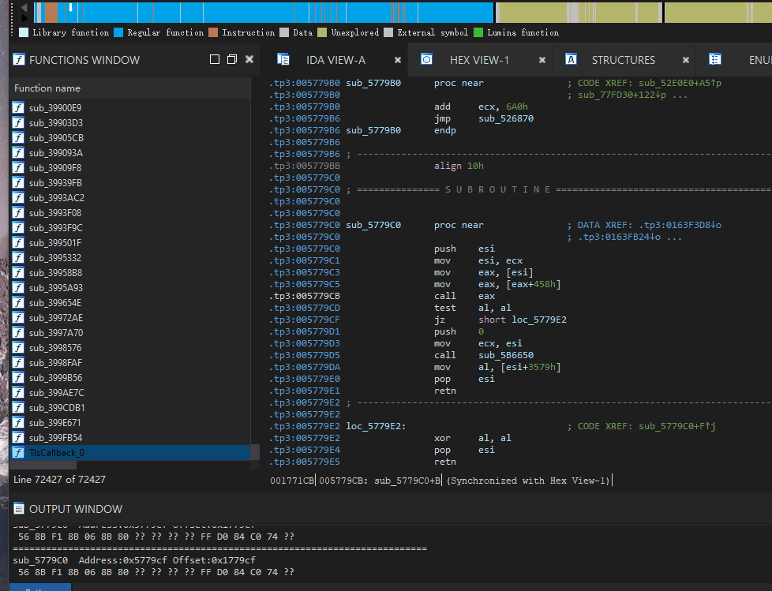

转至: https://github.com/Chordp/PatternGen

# PatternGen

> ida sig pattern generate pulgin<br>
> copy on plugins directory<br>
> shortcut key **alt+z**<br>
> 必须要 IDA Python
> 修复个bug 去他妈的四舍五入

### 更新兼容Python3 和最新的ida 7.5



```
===========================================================================
MiDeletePteRun+5E Address:0x140346ede Offset:0x346ede

===========================================================================
MiDeletePteRun+1F8 Address:0x140347078 Offset:0x347078
 48 89 ?? ?? ?? 4D 8B E2 4C 89 ?? ?? 49 8B FA E8 ?? ?? ?? ?? 48 8B D8 48 ?? ?? ?? ?? ?? ?? ?? ?? ?? 48 ?? ?? ?? 48 23 D8 48 ?? ?? ?? ?? ?? ?? 0F ?? ?? ?? ?? ??
```

